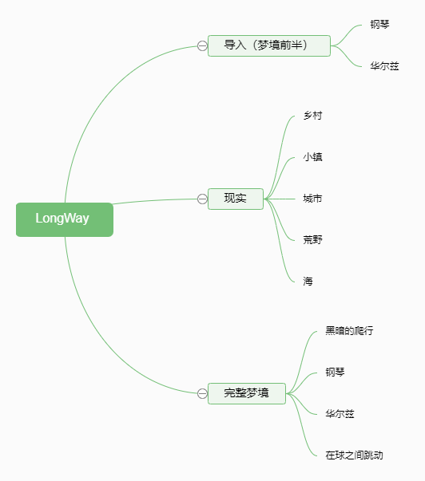
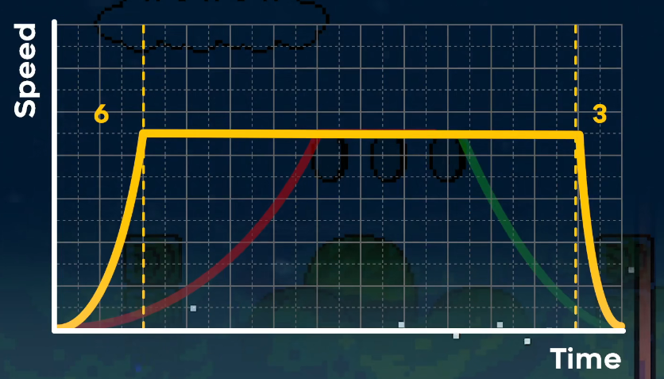
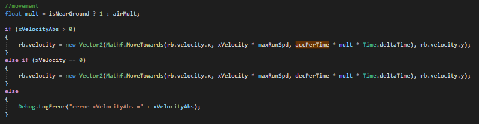
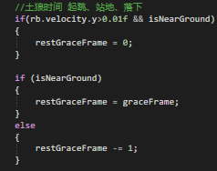
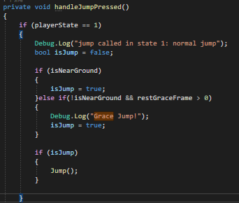
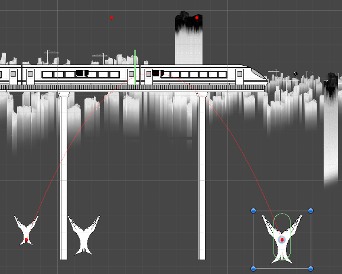

# 2D_LongWay

### 1.简介

这是一款使用unity开发的2D平台游戏demo的源码，开源的目的主要是拿来找工作展示。

游戏内容总体完整，但有一些恶性bug和不完善的地方。可能出现玩了半个多小时快结束了结果被bug卡死游戏进行不下去的情况。不过嘛，理论上来说只要不在难度最高的几个地方死在奇怪的位置就不会触发恶性bug（笑）。

对内容感兴趣可以看看游玩演示视频：

游戏演示视频地址：https://www.bilibili.com/video/BV1Ej411i7jM/

### 2.设计思路

该游戏的内容分为以下部分

### 3.功能实现

#### 3.1 玩家控制脚本

玩家移动的脚本其实参考了celeste：[NoelFB/Celeste: Celeste Bugs & Issue Tracker + some Source Code (github.com)](https://github.com/NoelFB/Celeste)，但这注定是一次绝望的尝试。我个人认为是因为celeste的核心冲刺机制这个游戏里面是没有的，而且细节打磨和相关素材也完全达不到标准。所以，在调试过程中我完全没有体会到自己折腾了大半天折腾出来的东西对手感有任何的改善。

但不管怎样，在阅读了部分的celeste关于移动的代码以后，结合GMTK|Why Does Celeste Feel So Good to Play? 里面提到的一种相对慢加速，但停止快速的移动曲线，我也自定义了一套优化移动手感的方法。

首先public角色的最大速度，并通过readonly的加速时间与减速时间计算出为了达到指定的最大速度，应该用多大的加速度进行加速。计算得到加速时的加速度、减速时的加速度、定义空气阻力之后，通过下面这个式子来实现一种类似上图的稍慢加速，稍快停止的方法。我这里用的线性插值，而不是曲线。(PlayerKid.cs)

以及土狼时间(PlayerController.cs)：

这些工作可能很不明显，但是确实存在的。不如说，我写这份文档的目的就是让这些工作看起来更像一回事。

#### 3.2 场景刷新

当游戏中的角色死亡时，需要刷新大多数物体的位置与状态，将所有物体分为两类：在被触发后不久就会自动刷新与只有角色死亡后刷新。在这些需要角色死亡才刷新的物体上挂载一个FreshItem脚本，当角色死亡时，向所有FreshItem脚本发送信息进行刷新。

#### 3.3 场景中摆放的物体

这一节对所有场景中摆放的物体进行一些介绍。

##### 3.3.1 现实关卡部分

弹跳的轮胎：玩家碰到该物体时，给一个向上的基础速度。

弹跳硬币：玩家进入物体的范围时，将物体设置为可响应空格，并给进入范围的player里面设置一个回调。当响应空格时，触发这个回调。

冲刺钱币：给钱币设置多个状态，第一次触发冲刺以后，使其向后移动指定距离并更新状态。

气球：同弹跳的轮胎

遮阳伞：同弹跳的轮胎

鱼手：写了一个Bezier曲线来根据输入的坐标点确定路径，并使用扩展编辑器在界面中画出，从而供关卡策划来自定义怪物的路径。通过一个Trigger来触发这个曲线。

各类类似的移动物体同上。

伞：在玩家身上明确唯一的Buoyancy Effector2D(浮力效应组件)，碰撞到组件时更新这个组件，并通过空格对组件进行控制。

划船：通过几个碰撞体和控制器进行模拟划船的画面。

##### 3.3.2 梦境关卡部分

钢琴：设置一个数组作为曲谱，设置index=0，根据下标来高亮琴键。当踩下琴键时，按照曲谱进行判断是推动index还是重置index。

滑动：设置角色为不可控制，仅通过一个加速度进行控制。